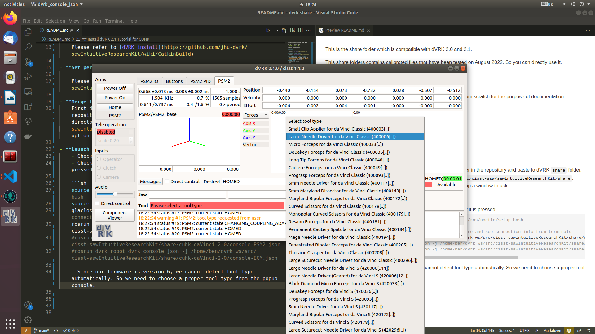

This is the share folder which is compatible with dVRK 2.0 and 2.1.

## Note

- This repository help you skip the [calibration](https://github.com/jhu-dvrk/sawIntuitiveResearchKit/wiki/Calibration) and setting some [json files](https://github.com/linhongbin-ws/dvrk-share/tree/main/share/cuhk-daVinci-2-0).
- We calibrate the system on 2021 August. If daVinci is moved, it might need to be re-calibrated

## Install dVRK 2.1 Tutorial for CUHK

Here we will give a quick and complete tutorial to install dVRK from scratch for the purpose of documentation.

Install in the following sequence:
- **Install ROS**
- **Install dVRK**

    Please refer to [dVRK install](https://github.com/jhu-dvrk/sawIntuitiveResearchKit/wiki/CatkinBuild)

- **Set permissions for FireWire devices**
  
    Please Refer to [Controller Connect](https://github.com/jhu-dvrk/sawIntuitiveResearchKit/wiki/ControllerConnection)

- **Merge this github repository to the dVRK share folder**
    First download this github repository, then copy `share` folder in the repository and paste to dVRK `share` folder. For example, the directory could be `/home/ben/dvrk_ws/src/cisst-saw/sawIntuitiveResearchKit/share`. Choose the `merge` and `replace` option if the system pop up a window to ask. 

- **Launch dVRK console**
    - Check 1394 firewire connection.
    - Check if Estop is un-pressed. The system will be work if it is pressed.

    ```sh
    source /opt/ros/melodic/setup.bash # or source /opt/ros/noetic/setup.bash
    source <path-to-dvrk>/devel/setup.bash
    qlacloserelays # should hear tick sound from hardware and see connection info from terminals
    rosrun dvrk_robot dvrk_console_json -j /home/ben/dvrk_ws/src/cisst-sawIntuitiveResearchKit/share/cuhk-daVinci-2-0/console-PSM1.json
    #rosrun dvrk_robot dvrk_console_json -j /home/ben/dvrk_ws/src/cisst-sawIntuitiveResearchKit/share/cuhk-daVinci-2-0/console-PSM2.json
    #rosrun dvrk_robot dvrk_console_json -j /home/ben/dvrk_ws/src/cisst-sawIntuitiveResearchKit/share/cuhk-daVinci-2-0/console-ECM.json
    ```
    - Since our firmware is version 6, we cannot detect tool type automatically. So we need to choose a proper tool type from the popup console.
      


- **Get real-time videos from endoscope**
  - Check S-video wire connection
  - Check if the video devices are turned on. 
  - Get video
    ```sh
    v4l2-ctl -d /dev/video0 -i 1 # left cam
    #v4l2-ctl -d /dev/video1 -i 1 # right cam
    ffplay /dev/video0  # left cam
    #ffplay /dev/video1 # right cam
   ```

